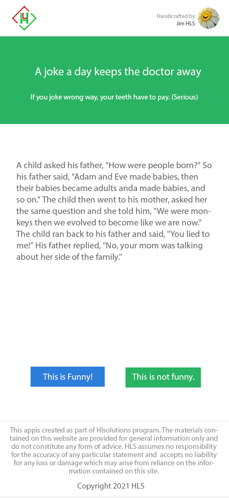

# hl_assignment_mobile

# Jokee Single Serving APP
This is a Flutter evaluation test to create a single serving APP that displays jokes for user to vote.

## Requirements
This app will display a single joke for the user to read.
After reading the joke, the user will like or dislike the joke.
The app will record the vote in database and then show another joke for the user to read.
When there is no more jokes to show, the app will display a `"That's all the jokes for today! Come back another day!"` message.

There is no need to display the result of the votes.
User should not see the same joke twice.
User do not need to register or login to view the joke or vote for the joke.

## Technical Note
App will use cookie to track if a user has voted for a joke.
It is okay if the user clears his cookie and votes again.

## Jokes Content

A child asked his father, "How were people born?"
So his father said, "Adam and Eve made babies, then their babies became adults and made babies, and so on."

The child then went to his mother, asked her the same question and she told him, "We were monkeys then we evolved to become like we are now."

The child ran back to his father and said, "You lied to me!"
His father replied, "No, your mom was talking about her side of the family."

-----

Teacher: "Kids,what does the chicken give you?"
Student: "Meat!"
Teacher: "Very good! Now what does the pig give you?"
Student: "Bacon!"
Teacher: "Great! And what does the fat cow give you?"
Student: "Homework!"

-----

The teacher asked Jimmy, "Why is your cat at school today Jimmy?"
Jimmy replied crying, "Because I heard my daddy tell my mommy, 'I am going to eat that pussy once Jimmy leaves for school today!'"

-----

A housewife, an accountant and a lawyer were asked "How much is 2+2?"
The housewife replies: "Four!".
The accountant says: "I think it's either 3 or 4.  Let me run those figures through my spreadsheet one more time."
The lawyer pulls the drapes, dims the lights and asks in a hushed voice, "How much do you want it to be?"